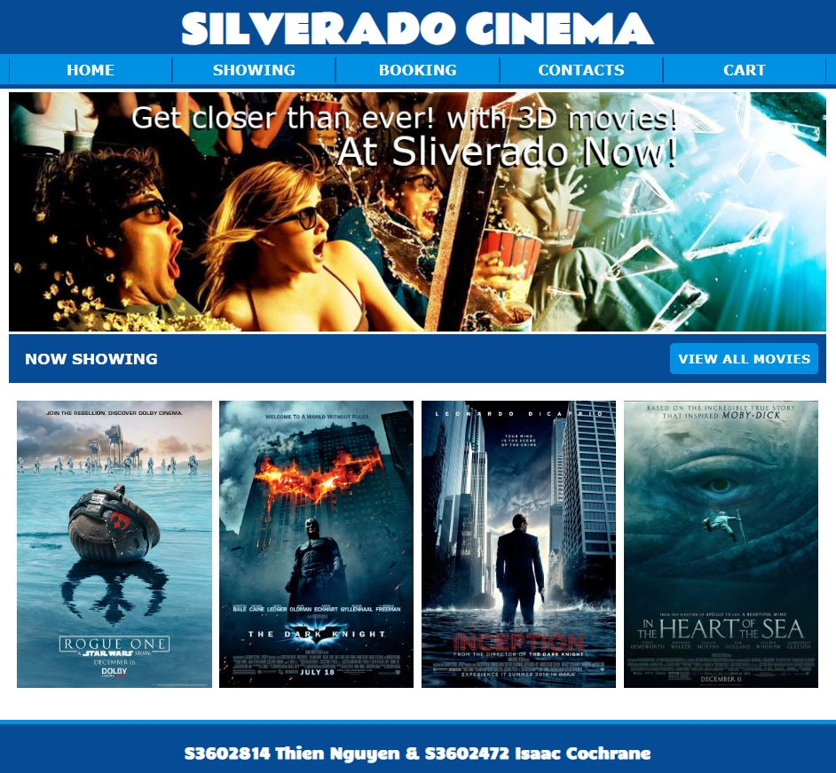

# COSC2413 AT2 & AT3 | Silverado Cinema
**Course Name:** Web Programming (2017, Semester 2)

A movie booking website which was designed and developed for Silverado Cinema (a mock client) as an assignment using HTML, CSS, JavaScript and PHP. The aim was to promote the client's business and take online bookings with client-side and server-side validation.

Assignment Task 2 focuses on getting a basic prototype of the website working (displaying the colour scheme, intended features, etc.) using HTML and CSS. Assignment Task 3 focuses on completing the entirety of the website with all features implemented using PHP, JavaScript, modern coding conventions and an emphasis on clean code.
